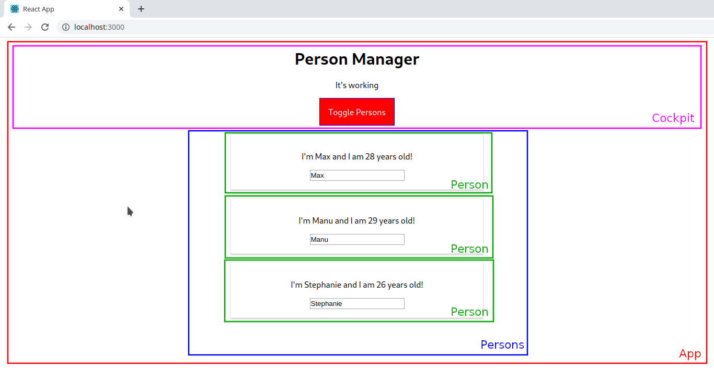

# React Component Lifecycle Example

This is a simple React Application that helps to understand and see the React Component Lifecycle in action. It was created using [Create React App](https://github.com/facebook/create-react-app).

## Table of Contents

- [Getting Started](#getting-started)
    - [Prerequisites](#prerequisites)
    - [Install dependencies](#prerequisites)
- [Run the Application](#run-the-application)
- [Folder structure](#folder-structure)
- [Components](#components)
- [Lifecycle Tracking](#lifecycle-tracking)
    - [Creation](#creation)
    - [Update](#update)
- [React Hooks Equivalents](#react-hooks-equivalents)
- [License](#license)

## Getting Started

### Prerequisites
- Node >= 8.10
- Yarn >= 0.25

### Install dependencies

In the project directory, run:

```
yarn
```

To install all the project dependencies.

## Run the Application

In the project directory, you can run:
```
yarn start
```

Runs the app in the development mode.
Open http://localhost:3000 to view it in the browser.

The page will reload if you make edits.
You will also see any lint errors in the console.

## Folder structure

The application has very similar folder structure that an application created with [Create React App](https://github.com/facebook/create-react-app). We just added `assets`, `components` and `containers` (where we keep components such as `App`) folders.

```
react-lifecycle-example
├── LICENSE
├── README.md
├── node_modules
├── package.json
├── yarn.lock
├── .gitignore
├── public
│   ├── favicon.ico
│   ├── index.html
│   ├── manifest.json
│   └── robots.txt
└── src
    ├── index.css
    ├── index.js
    ├── logo.svg
    ├── serviceWorker.js
    ├── setupTests.js
    ├── assets
    ├── components
    └── containers
        └── App
            ├── App.module.css
            ├── App.js
            └── App.test.js
```

## Components


This is a very simple application and it has just four components at all.

- App
- Cockpit
- Person
- Persons

`App` is the container of the application, it stores and manupulates all the information needed in it's state.

`Cockpit` contains some information based on data stored in `App` component, it was created to demonstrate the React Component Lifecycle when there is an update.

`Person` contains information about a Person (really?) it has a input with two-way binding and was created to demonstrate how this work.

`Persons` is a container for a list of `Person` components. It was created to demonstrate how we can optimze the application without do some unnecessary `render` calls.


## Lifecycle Tracking

All the lifecycle tracking was built using `console.log()` calls inside React [lifecycle methods](https://reactjs.org/docs/state-and-lifecycle.html). Follow the description below of how this lifecycle works when a component is created and also when it's updated.

### Creation


The image describes the sequence of lifecycle methods calling for the class-based components. And also have a little description of what this methods do and that you can/can't do inside them. 

To see this in action, we put some `console.log()` calls inside those methods like:
```javascript
constructor(props) {
  super(props);
  console.log('[App.js] constructor');
  this.state = INITIAL_STATE;
}

static getDerivedStateFromProps(props, state) {
  console.log('[App.js] getDerivedStateFromProps', props);
  return state;
}

componentDidMount() {
  console.log('[App.js] componentDidMount');
}
```

See the result below:


When we click in **Toggle Persons** button, the `Person` components are created and we can see the lifecycle methods calls. See the image below:


### Update


The image describes the sequence of lifecycle methods calling for the class-based components. And also have a little description of what this methods do and that you can/can't do inside them. 

To see this in action, we put some `console.log()` calls inside those methods like:
```javascript
constructor(props) {
  super(props);
  this.state = {};
}

static getDerivedStateFromProps(props, state) {
  console.log('[Persons.js] getDerivedStateFromProps');
  return state;
}

shouldComponentUpdate(nextProps, nextState) {
  console.log('[Persons.js] shouldComponentUpdate');
  return true;
}

getSnapshotBeforeUpdate(prevProps, prevState) {
  console.log('[Persons.js] getSnapshotBeforeUpdate');
  return null;
}

componentDidUpdate() {
  console.log('[Persons.js] componentDidUpdate');
}
```

See the result below:


When we type a new character in one of input text inside `Person` component like 'T', for example, the state of the application is updated and the `Persons` components are updated, so, we can see the lifecycle methods calls. See the image below:


## React Hooks Equivalents

In this section you can check how to implement the same features of React Class-Based Components with [React Hooks](https://reactjs.org/docs/hooks-intro.html).


| Class-Based Component Feature | React Hooks |
|-----------------------------|-----------|
|`componentDidUpdate() {`     |`useEffect(() => {`|
|`  console.log('componentDidUpdate');`|`  console.log('componentDidUpdate equivalent');`|
|`}` |`});`|
|<pre lang="javascript">componentDidMount()</pre>|<pre lang="javascript">useEffect(() => {<br />  console.log('componentDidMount equivalent'); <br/>}, [])</pre>|
|<pre lang="javascript">componentWillUnmount()</pre>|<pre lang="javascript">useEffect(() => {<br />  return () => console.log('componentWillUnmount equivalent');<br />}, [])</pre>|

## License

React Component Lifecycle Example is open source software [licensed as MIT](https://github.com/davipviana/react-lifecycle-example/blob/master/LICENSE).